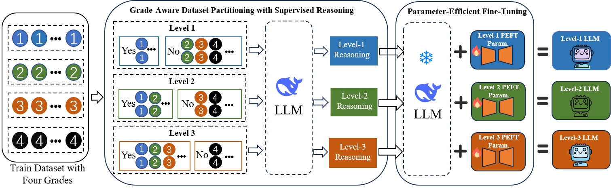
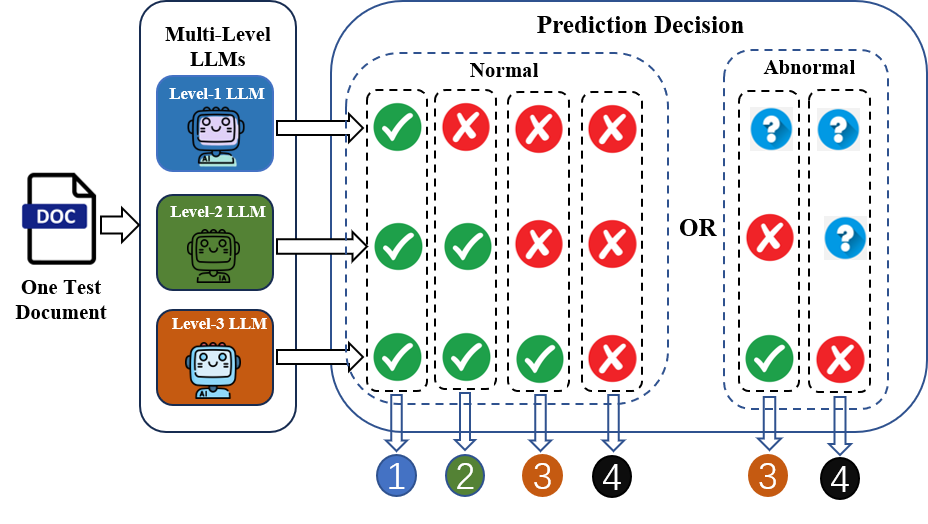

# Chinese Text Readability Assessment via Grade-Specific Parameter-Efficient Fine-tuning


## Overview

- **Interpretability & Educational Alignment**:  
  In educational NLP, assessing the readability of Chinese texts is crucial yet challenging. While deep learning methods have demonstrated strong performance due to their expressive power, they often suffer from limited interpretability. This makes it difficult to understand or trust the model's decisions, particularly in cognitively sensitive educational settings. Furthermore, existing models struggle with fine-grained comprehension distinctions across different grade levels, limiting their effectiveness in real-world classroom applications.

- **Grade-specific Language Understanding**:  
  Inspired by the cognitive progression of language acquisition in students, we introduce a novel paradigm that leverages parameter-efficient fine-tuning (PEFT) to model grade-specific understanding. Our method assigns a dedicated PEFT module to each readability grade, allowing the model to retain and reuse distinct linguistic and cognitive patterns specific to each level. This approach results in a suite of lightweight student models that better simulate how learners at different stages comprehend language.

<div align="center">
  
</div>

To address the limitations of current methods, we propose **One PEFT Per Grade (OPPG)**, a cognitively inspired framework designed for interpretable and accurate Chinese text readability assessment. OPPG integrates grade-level PEFT modules into a shared pre-trained backbone, combining the strengths of parametric knowledge (captured in grade-specific adapters) with the generalization power of foundation models. By doing so, OPPG enables the creation of interpretable, modular, and scalable student simulators for educational use.

Extensive experiments on a large-scale Chinese textbook corpus demonstrate that OPPG significantly outperforms prompt-based baselines in both classification accuracy and alignment with human-annotated grade labels. In addition, OPPG provides improved transparency in model reasoning, offering clearer explanations aligned with educational theory and making it better suited for deployment in teaching and assessment systems.

<div align="center">
  
</div>


## Installation ##
Please install the dependencies via conda, using the following command:

```bash
pip install -r requirements.txt
```

## Experiment

### Fine-Tuning with LLaMA-Factory

We utilize the [LLaMA-Factory](https://github.com/hiyouga/LLaMA-Factory) framework for fine-tuning. Please refer to the official repository for detailed implementation instructions.

To launch the Web UI for fine-tuning:

```bash
CUDA_VISIBLE_DEVICES=0 GRADIO_SHARE=1 GRADIO_SERVER_PORT=7860 llamafactory-cli webui
```

### OPPG: One PEFT Per Grade

#### Fine-Tuning Multi-Level Models

We fine-tune separate models on datasets of different grade levels to obtain:

- `Level-1 LLM`
- `Level-2 LLM`
- `Level-3 LLM`
- `Level-4 LLM`

Each level corresponds to a model adapted for assessing text readability appropriate to a specific grade.


### Evaluation

After fine-tuning, start OpenAI-style API services for each level-specific model:

```bash
CUDA_VISIBLE_DEVICES=0 GRADIO_SERVER_PORT=7860 llamafactory-cli api examples/inference/level_1.yaml
CUDA_VISIBLE_DEVICES=0 GRADIO_SERVER_PORT=7861 llamafactory-cli api examples/inference/level_2.yaml
CUDA_VISIBLE_DEVICES=0 GRADIO_SERVER_PORT=7862 llamafactory-cli api examples/inference/level_3.yaml
CUDA_VISIBLE_DEVICES=0 GRADIO_SERVER_PORT=7863 llamafactory-cli api examples/inference/level_4.yaml
```
Once the services are running, evaluate your dataset using:
```bash
python ./code/OPPG.py \
    --input_file {DATA_PATH} \
    --output_file {RESULT_JSON_PATH}
```

```Finally```, the accuracy, recall, precision, F1, and confusion matrix of the prediction results are calculated.
```bash
python ./code/test.py \
    --input_file {RESULT_JSON_PATH} \
```
